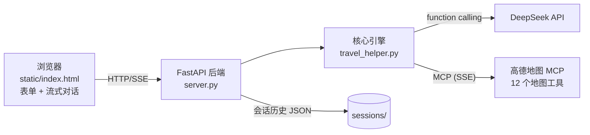

# Travel Helper —— AI 旅行规划助手

基于 **DeepSeek + 高德地图 MCP** 的旅行路线规划助手，复现 Dify travel helper 工作流的完整能力，并扩展为前后端分离的 Web 应用。

输入结构化的旅行需求（目的地、天数，以及可选的日期、人数、预算、想去的景点），Agent 会自主调用高德地图 MCP 检索真实数据（景点、距离、路线、天气），再由专业旅游助手生成一份贴合需求的行程路线，支持多轮对话持续调整。

## 功能特性

- **结构化需求输入**：`TripRequest`（目的地、天数必填；出行日期、人数、预算、意向景点选填），自动拼装为自然语言查询
- **Agent 自主检索**：DeepSeek 原生 function calling 循环调用高德地图 MCP 的 12 个工具（上限 15 轮），汇总真实地理数据
- **专业路线生成**：沿用原 Dify 工作流的"专业旅游助手"提示词，输出贴心的行程规划（含预算分解、天气提示、预约建议）
- **多轮对话**：首轮规划后可自由追问（如"第二天换成博物馆"），基于上下文调整行程
- **流式 Web 界面**：SSE 实时推送检索过程（每次地图工具调用）与路线文本（打字机效果）
- **会话持久化**：刷新页面自动恢复对话；"结束旅程"一键清理历史

## 架构



处理流程对应原 Dify 工作流的三段式：

1. **Agent 检索阶段**：LLM 作为检索助手循环调用高德工具（地理编码 → POI 搜索 → 详情/路线/天气），直到信息充足
2. **路线生成阶段**：将用户上下文与检索结果注入"专业旅游助手"提示词，流式生成路线
3. **多轮对话**：完整对话历史参与后续每一轮检索与生成

## 项目结构

```
├── travel_helper.py       # 核心引擎：TripRequest、高德 MCP 客户端、两阶段流程、命令行交互
├── server.py              # FastAPI 后端：会话管理 + SSE 流式接口 + 静态页面托管
├── static/
│   └── index.html         # 前端单页（原生 HTML/JS，零构建）
├── test_travel_helper.py  # 引擎单元测试
├── test_server.py         # 后端单元测试
├── test_mcp.py            # 高德 MCP 连通性测试
├── travel helper.yml      # 原始 Dify 工作流定义（本项目复现的来源）
├── docs/plans/            # 实施计划文档
├── sessions/              # 会话历史（运行时生成，不入库）
└── .env                   # API Key（不入库）
```

## 快速开始

### 1. 安装依赖

```bash
python -m venv .venv
.venv\Scripts\activate        # Windows；Linux/macOS 为 source .venv/bin/activate
pip install fastapi uvicorn sse-starlette openai mcp pydantic pytest httpx
```

### 2. 配置 API Key

在项目根目录创建 `.env`：

```
LLM_API_KEY=sk-你的DeepSeek密钥
```

支持 `DEEPSEEK_API_KEY` 或 `LLM_API_KEY` 两个变量名，也可直接设置同名环境变量。

### 3. 运行

```bash
python server.py
```

浏览器打开 <http://127.0.0.1:8000>，填写表单即可开始规划。

不需要 Web 界面时，可用命令行模式（逐项问答输入）：

```bash
python travel_helper.py
```

## API 接口

| 方法 | 路径 | 说明 |
|------|------|------|
| POST | `/api/session` | 新建会话，返回 `{"session_id": "..."}` |
| GET | `/api/session/{id}` | 取回会话历史消息 |
| DELETE | `/api/session/{id}` | 结束会话并删除历史文件 |
| POST | `/api/chat` | 对话（SSE 流式响应） |

`/api/chat` 请求体（首次用结构化需求，后续轮次用自由文本，二选一）：

```json
{
  "session_id": "...",
  "trip_request": {
    "days": 3,
    "destination": "杭州",
    "people": "2大1小",
    "budget": "5000元",
    "attractions": ["西湖", "灵隐寺"],
    "date": "十月初"
  }
}
```

```json
{ "session_id": "...", "query": "第二天改成博物馆路线" }
```

SSE 事件流：

| 事件 | 内容 | 说明 |
|------|------|------|
| `tool` | `{name, args}` | 检索阶段每次高德地图工具调用 |
| `token` | `{text}` | 路线生成阶段的增量文本 |
| `done` | `{}` | 本轮对话结束 |
| `error` | `{message}` | 出错信息（检索失败时历史保持不变） |

## 测试

```bash
pytest -q
```

覆盖引擎（需求解析、查询拼装、schema 转换、历史管理）与后端（会话存取/容错、参数校验、SSE 端点 mock 测试）共 33 个单元测试。

## 技术栈

| 层 | 技术 |
|------|------|
| 前端 | 原生 HTML / CSS / JS（Fetch + SSE，零构建） |
| 后端 | Python · FastAPI · sse-starlette · Pydantic |
| LLM | DeepSeek（`deepseek-v4-flash`，OpenAI 兼容 SDK） |
| 地图工具 | 高德地图 MCP（ModelScope 托管，MCP Python SDK） |

## 致谢

- 原始工作流来自 Dify 的 travel helper 模板（见 `travel helper.yml`）
- 地图数据与工具由[高德开放平台](https://lbs.amap.com/)提供
